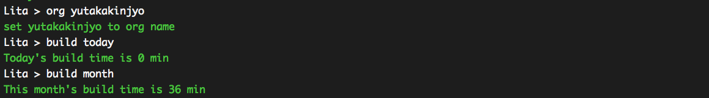

# lita-circletime

[](https://travis-ci.org/yutakakinjyo/lita-circletime)

This gem let to share CircleCI's amount of build time to channel member by Lita.



Free plan of CircleCI limit is 1,500 min build time. So sometimes we want to know how many spend build time already.

## Installation

Add lita-circletime to your Lita instance's Gemfile:

``` ruby
gem "lita-circletime"
```

## Configuration

Set your CircleCI access token to `.env` file like a following

.env
```
CIRCLE_CI_TOKEN='your access token'
```

or set token to environment valiable. Valiable name is same to `CIRCLE_CI_TOKEN`

## Usage

first step : set target organization name

```
org <organization name>
```

you can get build time

- `build today` get today's amount of build time
- `build yestaday` get yestaday's amount of build time
- `build week` get this week amount of build time
- `build month` get this month amount of build time
